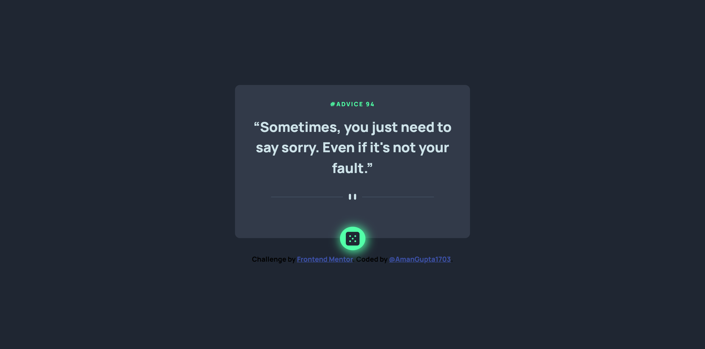
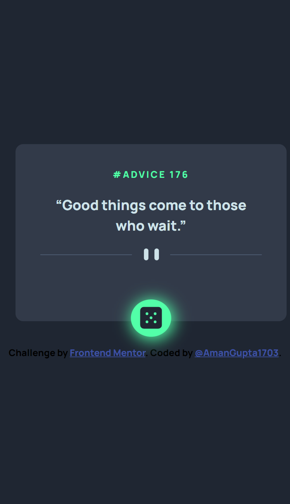

# Frontend Mentor - Advice generator app solution

This is a solution to the [Advice generator app challenge on Frontend Mentor](https://www.frontendmentor.io/challenges/advice-generator-app-QdUG-13db). Frontend Mentor challenges help you improve your coding skills by building realistic projects.

## Table of contents

- [Overview](#overview)
  - [The challenge](#the-challenge)
  - [Screenshot](#screenshot)
  - [Links](#links)
- [My process](#my-process)
  - [Built with](#built-with)
  - [What I learned](#what-i-learned)
  - [Continued development](#continued-development)
  - [Useful resources](#useful-resources)
- [Author](#author

## Overview

### The challenge

Users should be able to:

- View the optimal layout for the app depending on their device's screen size
- See hover states for all interactive elements on the page
- Generate a new piece of advice by clicking the dice icon

### Screenshot




### Links

- Solution URL: [Add solution URL here](https://your-solution-url.com)
- Live Site URL: [Add live site URL here](https://your-live-site-url.com)

## My process

### Built with

- Semantic HTML5 markup
- CSS custom properties
- Flexbox
- [React](https://reactjs.org/) - JS library

### What I learned

```js
  const [advice, setAdvice] = useState({
    id: "#Advice 13",
    quote:
      "If you're feeling tired or anxious, a pint of water will almost always make you feel better.",
  });

  const getRandomAdvices = async () => {
    const response = await fetch("https://api.adviceslip.com/advice");
    const data = await response.json();

    return data;
  };

  function handleClick() {
    getRandomAdvices().then(data => {
      setAdvice({
        id: data.slip.id,
        quote: data.slip.advice
      });
    }).catch(err => console.log("Not found!"));
  }
```

### Continued development

- Responsive Layout
- React Hooks

### Useful resources

- [BOX SHADOW](https://developer.mozilla.org/en-US/docs/Web/CSS/box-shadow)

## Author

- Website - [Add your name here](https://www.your-site.com)
- Frontend Mentor - [@AmanGupta1703](https://www.frontendmentor.io/profile/AmanGupta1703)